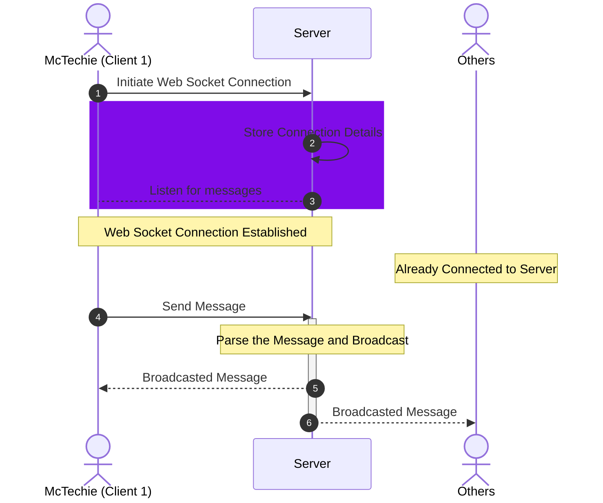
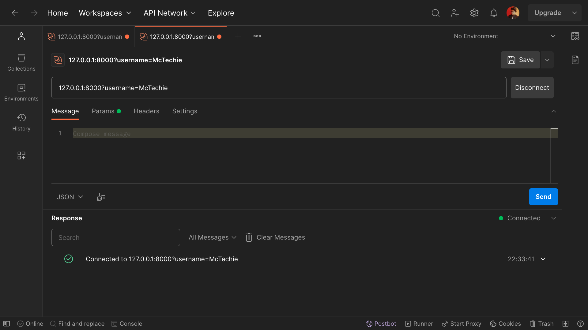
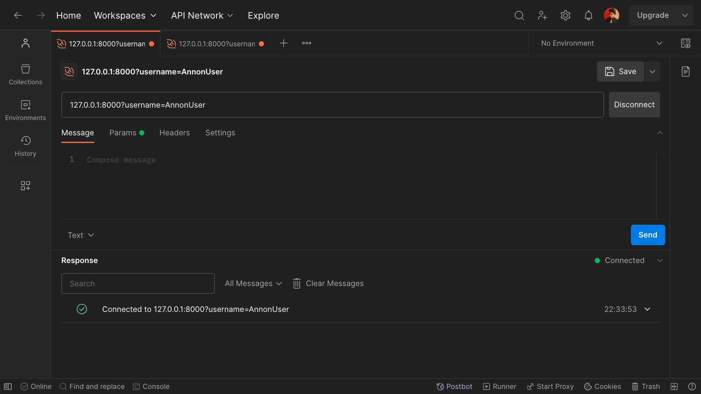
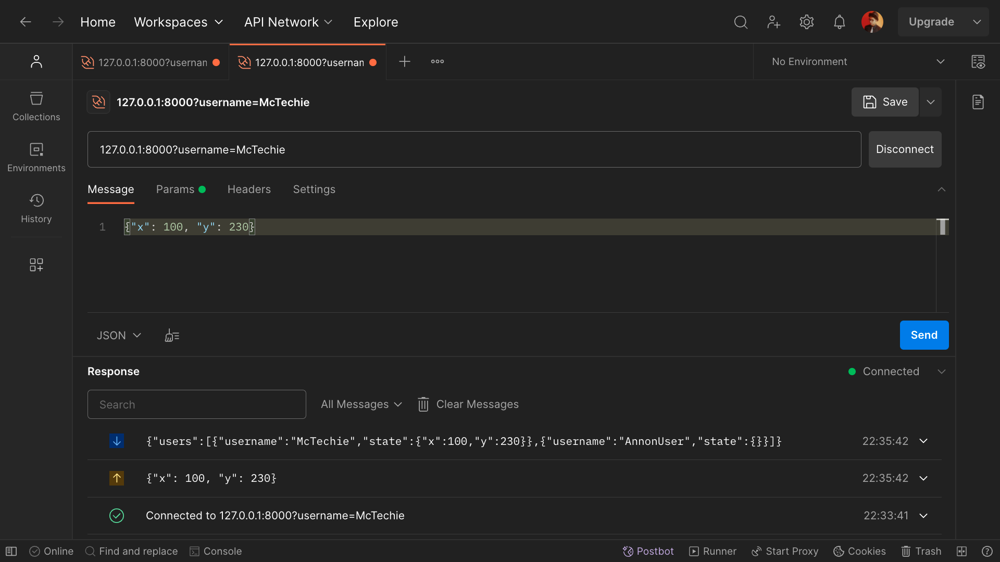
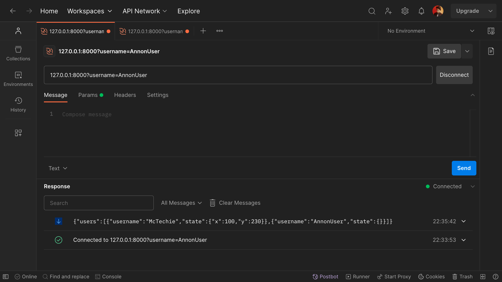
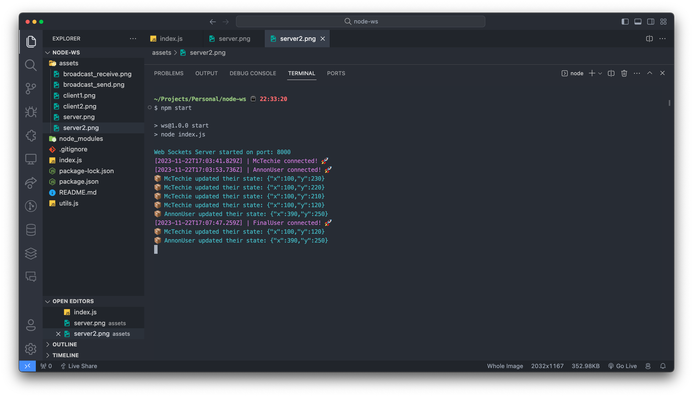

# WS + Node

> This is a simple example of how to use Web Sockets with Node.js, created for the purpose of learning.

### Architecture



### How to run

> This project requires Node.js to run.

```bash
# Clone the repository
git clone https://github.com/McTechie/node-ws-server.git

# Change directory
cd ws-server

# Install dependencies
npm install

# Run the server
npm start
```

### Demo

#### Client 1 [McTechie]



#### Client 2 [AnonUser]



#### Message Broadcast [McTechie]



#### Message Received [AnonUser]



#### Server Logs


